<div align="center">

# 👋 Hey there, I'm Finn!

[](https://git.io/typing-svg)

</div>

<div align="center">


[](https://github.com/arefin090)

</div>

---

## 🚀 About Me

```typescript
const finn = {
    role: "Site Reliability Engineer",
    education: "Computer Science Graduate",
    currentFocus: ["AI Technologies", "Model Context Protocols", "System Architecture", "System Design"],
    interests: ["Badminton 🏸", "Prompt Engineering", "System Reliability"],
    askMeAbout: ["Early Career Guidance", "SRE Best Practices", "AI Integration"],
    funFact: "I believe technology should make life easier, not complicated!"
};
```

## 🎯 Current Focus

```mermaid
graph TB
    subgraph "🤖 AI & Innovation"
        A[AI Research]
        B[MCP Development]
        C[Prompt Engineering]
    end
    
    subgraph "🏗️ Systems & Architecture"
        D[System Architecture]
        E[System Design]
        F[Performance Optimization]
    end
    
    subgraph "⚡ Infrastructure & SRE"
        G[Scalability]
        H[Reliability]
        I[Monitoring]
    end
    
    A --> D
    B --> E
    C --> A
    D --> G
    E --> H
    F --> I
    G --> H
    H --> I
    I --> F
    
    style A fill:#58A6FF,stroke:#1f2937,stroke-width:2px,color:#000
    style B fill:#34D399,stroke:#1f2937,stroke-width:2px,color:#000
    style D fill:#F59E0B,stroke:#1f2937,stroke-width:2px,color:#000
    style E fill:#EF4444,stroke:#1f2937,stroke-width:2px,color:#000
```



- 🔬 **Deep Diving Into**: AI technologies and MCP implementations
- 🏗️ **Architecting**: Scalable systems and robust infrastructure designs
- 📐 **Designing**: Distributed systems with focus on reliability and performance
- 🛠️ **Building**: Reliable systems that scale beautifully
- 📚 **Learning**: Advanced prompt engineering and architectural patterns
- 🎯 **Goal**: Making complex systems simple and reliable

## 🌐 Let's Connect

<div align="center">

[](https://linkedin.com/in/arefin-n-sojol)
[](mailto:arefin923@gmail.com)
[](https://aarefin.com)

</div>

## 🛠️ Tech Arsenal

<div align="center">


</div>

## 📊 Quick Stats

<div align="center">

[](https://github.com/arefin090)

</div>

<div align="center">

[](https://github.com/arefin090)
[](https://github.com/arefin090)

</div>

---

<div align="center">


**✨ "Code is like humor. When you have to explain it, it's bad." - Cory House ✨**

*Thanks for visiting! Feel free to reach out if you want to collaborate or just chat about tech, badminton, or life in general!* 🚀

</div>